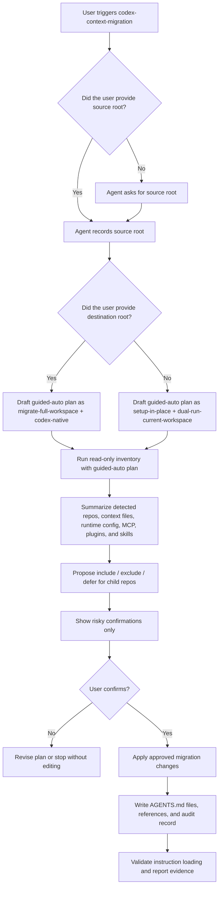

**English** | [한국어](README.ko.md)

# custom-skills

Personal AI agent skills for Claude Code and Codex, distilled from real sessions.

Each skill lives in its own directory with a `SKILL.md` (frontmatter + body).
To use a Claude Code skill, symlink it into `~/.claude/skills/`:

```bash
ln -s <repo-path>/<skill-name> ~/.claude/skills/<skill-name>
```

To use a Codex skill, symlink or copy it into `~/.codex/skills/`:

```bash
ln -s <repo-path>/<skill-name> ~/.codex/skills/<skill-name>
```

The target agent picks it up on the next session.

## Main Skill

[`codex-context-migration`](codex-context-migration/SKILL.md) is the public-ready
focus of this repo. It helps migrate Claude-era workspace and repository
context into Codex `AGENTS.md` files without blindly renaming `CLAUDE.md` or
dumping Claude runtime mechanics into always-loaded instructions.

Quick inventory:

```bash
python3 codex-context-migration/scripts/inventory.py \
  --source ~/old-workspace \
  --destination ~/new-codex-workspace \
  --guided-auto-plan \
  --format markdown
```

Typical flow:

1. Ask your agent to use `codex-context-migration` and provide the workspace
   root.
2. If you do not want to choose every migration label up front, ask for
   `guided-auto`. The agent drafts conservative defaults from inventory and
   asks only about risky choices.
3. The agent asks what operation you want, unless `guided-auto` already inferred
   a draft plan:
   - set up Codex in the current workspace (`setup-in-place`)
   - copy the whole workspace to a new Codex destination
     (`migrate-full-workspace`)
   - advanced: copy only context/knowledge/config files (`context-only`)
4. The agent runs the inventory helper, proposes include/exclude/defer choices
   for child repos, then waits for confirmation before editing files.
5. After confirmation, the agent writes `AGENTS.md`, audit records, and validates
   instruction loading with `codex exec`.

Default trigger workflow:



In this default path, `guided-auto` is a planning aid, not silent approval.
The agent should still ask before migrating private/local memory, hooks,
permissions, MCP write or production access, third-party bridges, or retained
Claude plugins.

## Skills

| Skill | One-liner |
|---|---|
| [`codex-context-migration`](codex-context-migration/SKILL.md) | Audit-first setup or migration from Claude-era repo context into Codex `AGENTS.md`, covering in-place setup, full-workspace migration, child repo include/exclude selection, Claude rules/local/import inventory, generated instruction review, parent-policy inheritance, Codex discovery/config audit, runtime config separation, plugin/skill ecosystem migration, MCP audit, and instruction-load validation. |
| [`triangulated-review`](triangulated-review/SKILL.md) | Three-reviewer parallel code audit with fact-checking for single-reviewer findings. Cost-pruned form of a larger multi-reviewer experiment. |
| [`zoom-caption-capture`](zoom-caption-capture/SKILL.md) | Stream Zoom Web Client live captions via a `MutationObserver` inside `iframe#webclient`, with token-level overlap merging and Blob-download dump. Lossless raw buffer + deferred cleanup so an LLM pass can produce final minutes. |

### `codex-context-migration`

Use when moving a workspace or repository from Claude-era context files such as
`CLAUDE.md`, `.claude/`, memory, and `.mcp.json` into Codex-native
`AGENTS.md` layers.

The skill can start with `guided-auto` for a lower-friction path: it drafts a
conservative migration plan from inventory signals, then asks only about risky
or materially changing choices. In manual mode it starts by choosing an
operation mode: set up Codex in the current workspace, migrate the full
workspace to a new destination, or use the advanced context-only path. It
records the trust level of existing `AGENTS.md` files, whether independent
child Git repositories should inherit workspace/root policy, and whether each
child repo should be included, excluded, copied without instruction rewrite, or
deferred. It then classifies source material, decides whether each area should
become native instructions, a bridge, private local context, or an omission,
and validates the result with `codex exec`.
Claude-native config/tooling repos such as `claude-config` are treated as
explicit defer/exclude candidates rather than silently included by a full
workspace migration.
Claude official plugins are also not treated as Codex defaults: the workflow
checks Codex official/curated/bundled/primary-runtime alternatives first,
records Codex-native replacement candidates, and retains Claude-side plugins
only after an explicit compatibility decision.

For larger workspaces, the bundled `scripts/inventory.py` helper can generate a
read-only child repo/context table from user-provided source and destination
paths, including `.claude/rules`, `CLAUDE.local.md`, Claude `@import` counts,
Codex override files, weak runtime-config signals, and optional
plugin/skill/command/hook/agent artifact inventory. The helper is only an
inventory aid; final include/exclude and ecosystem replacement decisions remain
part of the audit workflow.

It treats generated or converted `AGENTS.md` files as provenance to review, not
as defects by default. Quality claims must be backed by repo facts, stale
reference checks, and evidence that domain facts were preserved while execution
context was updated.

Claude runtime configuration such as hooks, permissions, slash commands, skills,
MCP servers, and SessionStart behavior is classified separately from durable
instructions so `AGENTS.md` does not become a dump of Claude-specific mechanics.

Best fit: users migrating from Claude-era context who have workspace-root
policy plus child repositories, private local context, MCP setup, or generated
instruction files to verify. For a single small repo, use the lightweight
inventory, rewrite, and validation parts only.

### `triangulated-review`

Use when a normal single-reviewer pass is too low-confidence: after a
substantial feature merge, before a public release, or before applying a risky
quality/security fix set.

The skill runs three independent review lenses in parallel, consolidates
overlapping findings, and sends single-reviewer findings through one fact-check
pass before anything is applied. It intentionally asks reviewers for
HIGH/CRITICAL findings only, because the original session that produced this
workflow found MEDIUM findings to be high-noise and rarely worth applying.

Best fit: larger code reviews where false positives and over-broad commits are
the main risk. Skip it for trivial PRs, formatter-only diffs, and small
single-file fixes.

### `zoom-caption-capture`

Use when the user is already in a Zoom Web Client meeting with live captions
visible and wants a transcript or meeting-minutes source. The skill attaches a
`MutationObserver` inside Zoom's `iframe#webclient`, records raw caption
snapshots, and dumps JSON that can be converted to Markdown.

The core design is lossless capture first, cleanup later. Zoom captions are a
rolling window, so the skill preserves raw fragments and performs token-level
overlap merging only as a best-effort intermediate step; final minutes should
still be cleaned up from the captured payload.

Best fit: web-client Zoom meetings where captions are already enabled. It does
not join meetings for the user, does not work with the native Zoom app, and
does not infer full speaker names when Zoom only exposes caption initials.

## Authoring conventions

- Frontmatter: `name`, `description`; Claude skills may also use `argument-hint`, `allowed-tools` as needed
- Body in English (config file rule); user-facing prose can be Korean where it helps
- Each skill should encode lessons from at least one real session — no speculative skills
- Anti-patterns section at the end if the skill has known failure modes
- To expose a skill in Codex/OpenAI skill lists, add `agents/openai.yaml` (UI + policy metadata; schema: [openai/codex skill-creator](https://github.com/openai/codex/blob/main/codex-rs/skills/src/assets/samples/skill-creator/references/openai_yaml.md))
