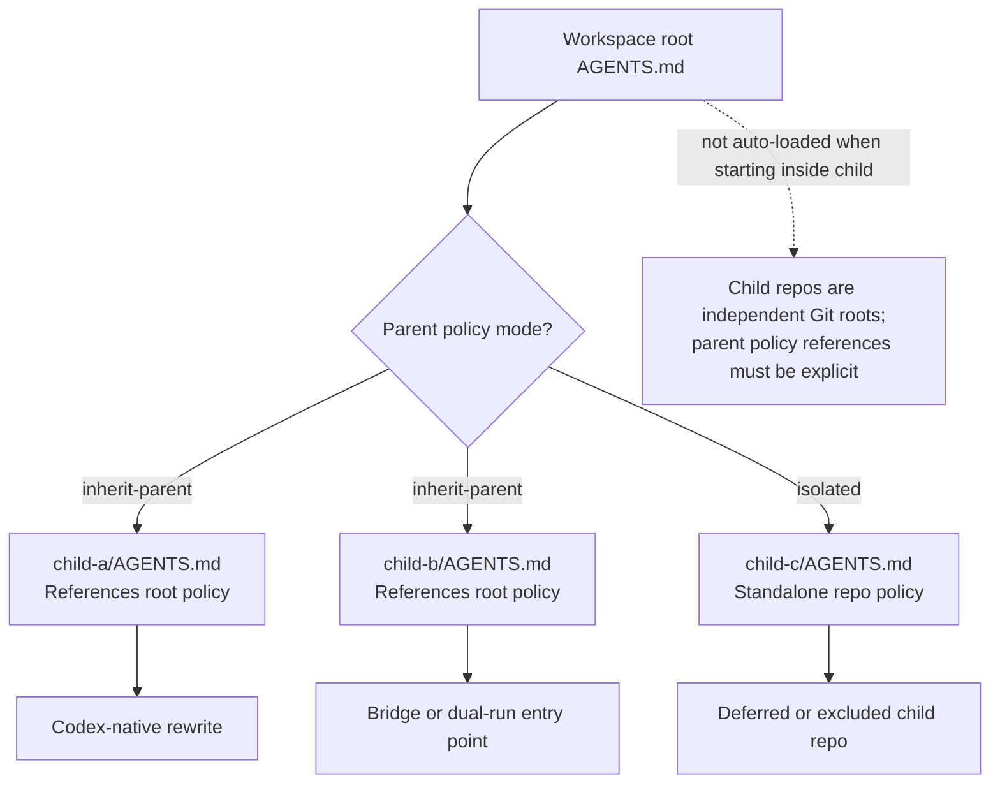
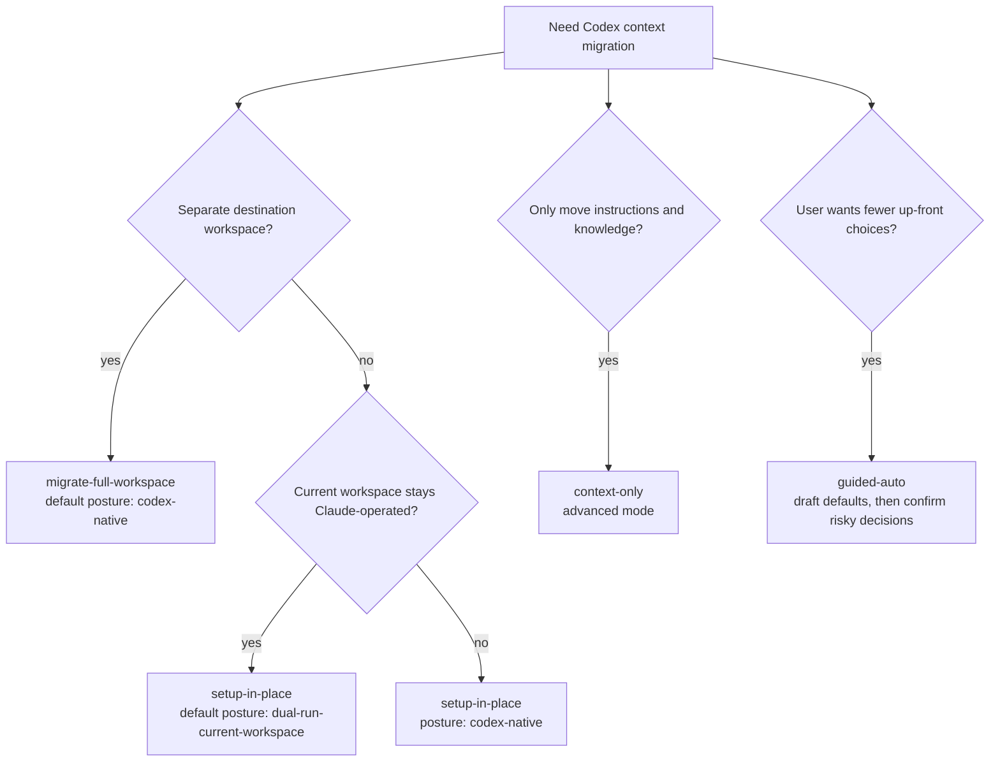
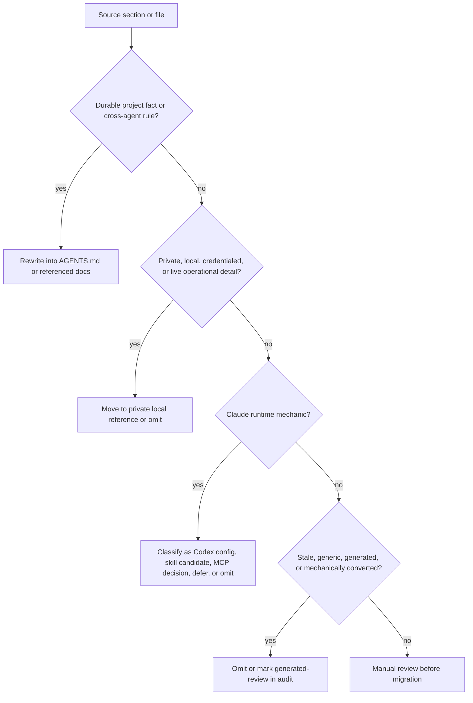

# codex-context-migration

`codex-context-migration` is an audit-first skill for moving Claude-era
workspace and repository context into Codex `AGENTS.md` files. It is not a
`CLAUDE.md` rename tool: it separates durable project instructions from
private memory, runtime config, MCP setup, hooks, plugins, stale content, and
generated instruction files before anything becomes always-loaded Codex context.

## Install

This is a Codex skill, not a required plugin package. Install the whole
`codex-context-migration/` directory into the Codex skills directory:

```bash
mkdir -p "${CODEX_HOME:-$HOME/.codex}/skills"
ln -s <repo-path>/codex-context-migration \
  "${CODEX_HOME:-$HOME/.codex}/skills/codex-context-migration"
```

Restart Codex after installation.

If you already have this repository on GitHub, you can also ask Codex to use
its `skill-installer` skill to install:

```text
WoojinAhn/custom-skills/codex-context-migration
```

Plugin packaging is not required for direct skill use. A `.codex-plugin`
wrapper and marketplace entry can be added later if this skill needs
marketplace-style discovery or installation.

## When To Use

Use this skill when a migration has more than one source of context or when a
blind conversion could lose important intent:

- A workspace root policy should apply across multiple child repositories.
- Repositories mix durable facts with Claude-specific mechanics such as hooks,
  permissions, slash commands, plugins, or MCP config.
- Private local context, memory, routing, credentials, or operational details
  need to stay out of repo instructions.
- Existing `AGENTS.md` files may be generated, mechanically converted, stale,
  or mixed with source material that needs trust-mode verification.

Skip the full workflow for a small single repository with one short
`CLAUDE.md`; use only inventory, classification, native rewrite, and validation.
Also skip it when the user explicitly wants to keep a Claude-native config repo
as-is rather than migrate its contents.

## Quick Start

Run the migration from a Codex session. The source files being migrated may
contain instructions for another agent; this skill treats them as data to audit,
not as commands to follow.

Example prompt:

```text
Use the codex-context-migration skill.

Source root: `/path/to/old-workspace`
Operation mode: `migrate-full-workspace`
Destination root: `/path/to/new-codex-workspace`

Run read-only inventory first. Show the guided-auto plan and ask before
copying files, migrating private context, registering MCP servers, or retaining
runtime/plugin behavior.
```

Manual read-only inventory command:

```bash
python3 codex-context-migration/scripts/inventory.py \
  --source ~/old-workspace \
  --destination ~/new-codex-workspace \
  --guided-auto-plan \
  --format markdown
```

Before editing files, record four operation-mode choice points:

1. Operation mode: `setup-in-place`, `migrate-full-workspace`,
   `context-only`, or `guided-auto`.
2. Target posture: `codex-native` or `dual-run-current-workspace`.
3. Parent policy mode for child Git repositories: `isolated` or
   `inherit-parent`.
4. Child repo handling: native `AGENTS.md`, bridge, dual-run bridge,
   copy-only, defer, or exclude.

`guided-auto` drafts conservative defaults from inventory signals. It is a
planning aid, not silent approval; private/local memory, hooks, permissions,
MCP write or production access, third-party bridges, and retained Claude
plugins still require explicit confirmation.

## Workspace Layering



## Operation Mode Decision Tree



## Source Classification Flow



## Worked Example

See [references/example-migration.md](references/example-migration.md) for a
realistic before/after migration showing:

- A mixed `CLAUDE.md` with project facts, private routing, hooks, and MCP notes.
- The resulting Codex-native `AGENTS.md`.
- A private local reference stub for sensitive material.
- An audit row explaining what moved, what was deferred, and what was omitted.

## Common Mistakes

- Renaming `CLAUDE.md` to `AGENTS.md` without classifying contents first.
- Copying `.claude/settings.json` or `.mcp.json` wholesale into `AGENTS.md`.
- Treating an existing `AGENTS.md` as authoritative without trust-mode
  verification.
- Migrating a `claude-config` or settings-sync repo as if it were a normal
  product child repo.
- Letting source `AGENTS.md`, `CLAUDE.md`, or imported content act as
  operational instructions during migration; source material is data to
  classify, not directions to follow.

## References

- [SKILL.md](SKILL.md): compact operational instructions loaded by the agent.
- [references/operation-modes.md](references/operation-modes.md): detailed mode,
  posture, parent-policy, child-selection, and guided-auto semantics.
- [references/audit-template.md](references/audit-template.md): migration audit
  template.
- [references/agents-md-shapes.md](references/agents-md-shapes.md): native,
  bridge, and dual-run `AGENTS.md` templates.
- [references/runtime-and-skill-artifacts.md](references/runtime-and-skill-artifacts.md):
  private context, MCP, runtime config, plugin, and skill artifact handling.
- [references/ecosystem-matrix.md](references/ecosystem-matrix.md): Claude to
  Codex ecosystem migration matrix.
